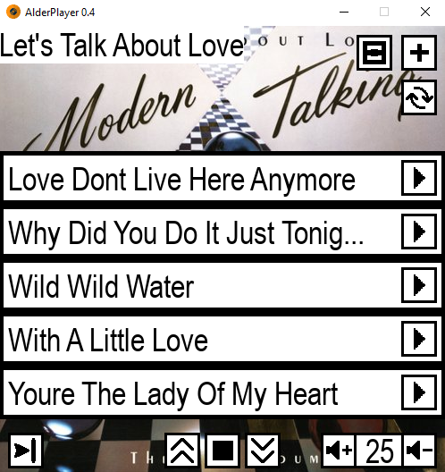
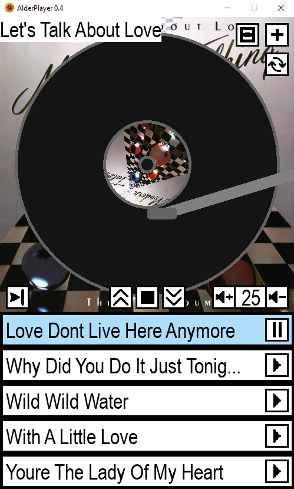

# AlderPlayer
Alderplay is an audio player I developed over several months in the spring 
and summer of 2025, attempting to replicate the concept of vinyl players and vinyl records. 
Its primary function is to play Aldervinyls—folders containing several audio (.mp3) 
files and, optionally, cover art (.png).

## Interface
This is a small window. The one you will usually see while selecting music.



The alternative to that is a bigger window which includes a graphical representation of a vinyl.



For the most part, the interface is kinda intuitive:
- Use play/pause buttons to play/pause songs
- Switch songs using the arrows in the middle
- Use the stop button to completely stop the song
- Change volume with the button in the right bottom corner

But here comes an interesting part:
- Use the plus signed button in the top right corner to change the vinyl
- Use that weird square signed button to switch between small and large windows
- Since in-real-life vinyl needs to be flipped to play some of its songs, you can do it by pressing two-arrowed button in the top right corner
- Use the button on the left bottom corner to change how next music will be selected 
    - Repeat
    - One side playing
    - Two side playing
    - Random
## How can I make it work?
Firstly, you need to create an Aldervinyl. As I said before, an aldervinyl is a folder made of:
- several (minimum 2) audio (.mp3) files
- cover art (.png). If you don't have any, the program will randomly suggest you on of three
predefined options

After filling a folder with some files, you should give it a new name which should look like this:
```
[name].ALDERVINYL
```
Folder that weren't named like this will be ignored.

After making a bunch of these, you should put all of them in one directory. Here comes the example of 
how the result can look like:
```
E:\
└── MyMusic\
    └── Aldervinyls\
        ├── Forever Young.ALDERVINYL
        ├── Led Zeppelin.ALDERVINYL
        └── The Queen Is Dead.ALDERVINYL
```

Now we need to go to the config file and change an "PathToAlderVinyls" option. You can also change "CurrentAlderVinyl"
option if you'd like to:

**Before:**
```
CurrentAlderVinyl: Back In Black
PathToAlderVinyls: D:\ALDERVINYLS 
Volume: 0.2
```
**After:**
```
CurrentAlderVinyl: Led Zeppelin
PathToAlderVinyls: E:\MyMusic\Aldervinyls 
Volume: 0.2
```

Now you're practically done! Feel free to launch the app!